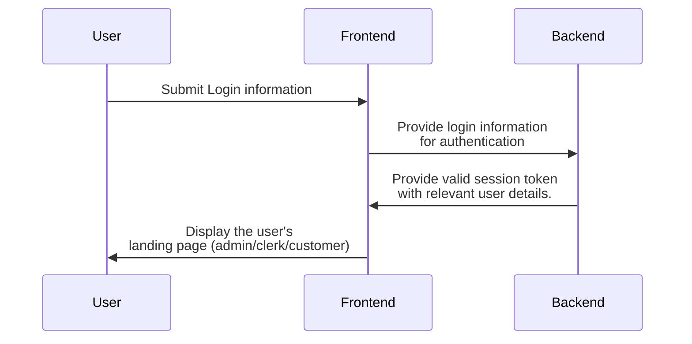
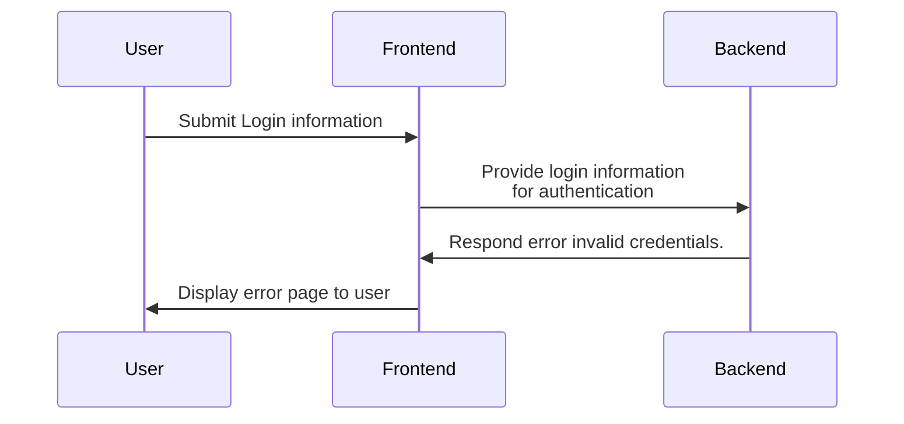

# User Diagrams

## User Login
### Success

  

  Notes:
  

- We can either provide different login portals with different DBs for User/Clerk/Admin, or a singular login portal, where the backend sends the user's Authorized credentials to the frontend.

### Fail

